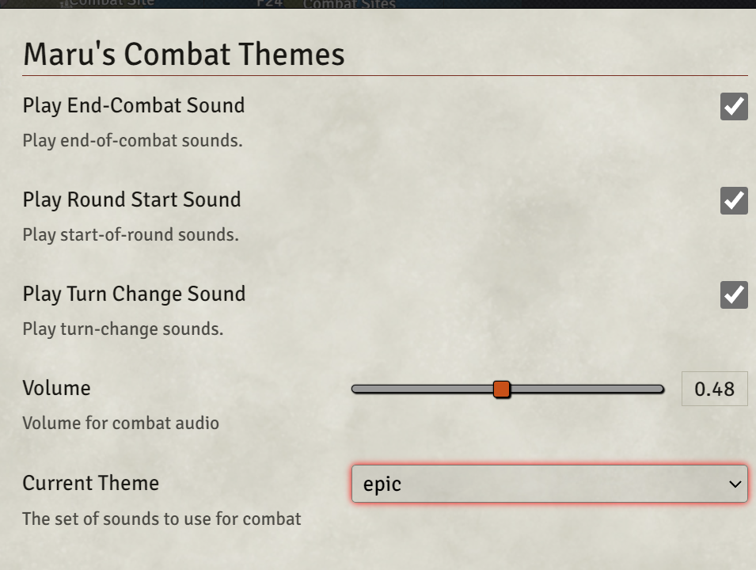
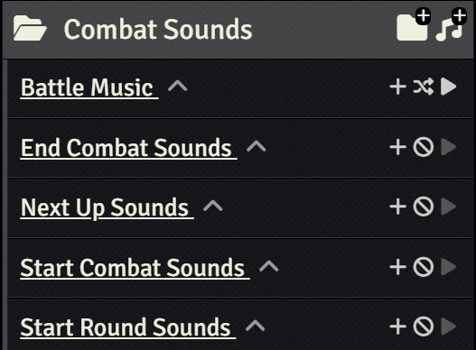
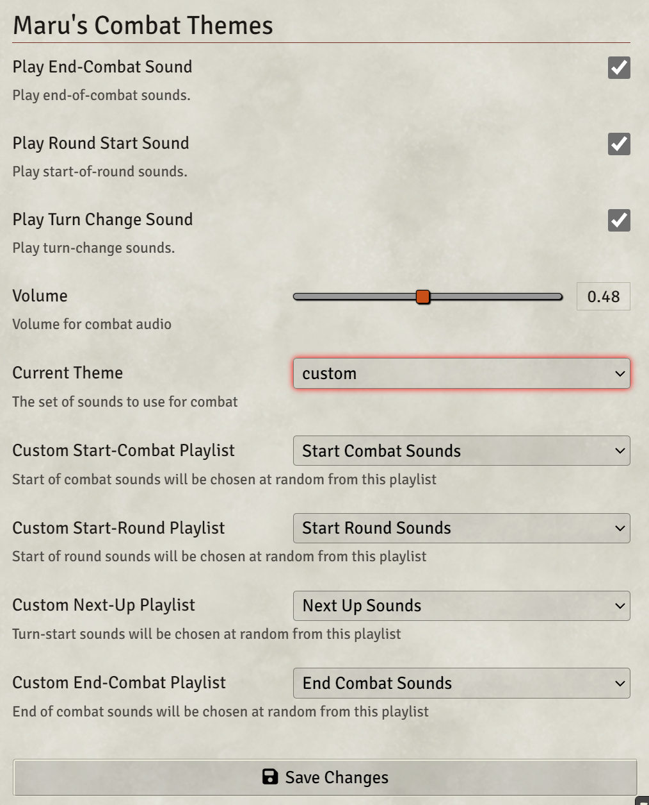

# Maru's Combat Themes

FoundyVTT's combat theme system is kinda cool as an idea (especially for more fighting-tournament themed campaigns/adventures) but pretty impractical to actually use. It has no way to customize what sounds play or add new sounds other than going and messing in the core filesystem, and the theme choice isn't even synced to all players. I found this very frustrating and limiting, so what started as a module to add some explicit new themes turned into this.

**This module Creates an entirely separate synced combat theme system that supports setting playlists for different combat events, and syncs playing sounds for all players. This allows the GM to set a consistent audio theme and control the experience.**

I made this for my Fists of The Ruby Phoenix campaign, so for me this system has allowed me to make a fun little synced combat announcer experience using fighting game references for my players to enjoy.

## Usage

To change your theme, select it from the dropdown menu in `Settings -> Maru's Combat Themes`. You can also find settings for whether to use the extra sound effect hooks there as well.

### Themes

This module should be compatible with any other module that adds to the list of combat themes. For example [Toon32's theme pack](https://foundryvtt.com/packages/combat-tracker-theme-pack) should work just fine.

### Using Custom Playlists

I recommend setting up a playlist for each sound-cue.

- go to Settings -> Maru's Combat Themes
- set the theme to "custom"
- assign playlists for each audio queue

**Example playlist setup**

**Example playlist config**

## Audio sourcing

You can find tonnes of fighting game and announcer sounds to play with on https://www.sounds-resource.com. I make no claim to anything regarding their safety to use from an IP perspective though! Probably don't use them if you run a podcast for your game or something.

## Development

To work on a local version I'd reccomend this workflow:
- Install the module using the module.json the usual way
- Clone this repo locally
- Go to the repo dir and run `npm install` to get some dev dependencies
- Run `npm run watch {path-to-your-local-foundry-install}/Data/modules/maru-combat-themes`
    - The path to foundry is usually something like `C://Users/{YOUR NAME}/AppData/Local/FoundryVTT`
    - This will run a watcher that copies in changed files to your local install, very useful for local testing!